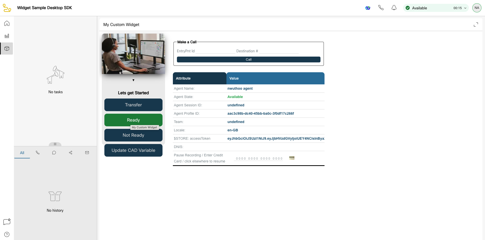

## Desktop JS SDK Sample Widget - working with the JS SDK

This is a tutorial on how to use the Desktop JS SDK Library along with a Vanilla JS Web Component desktop widget. In this tutorial we are using a few methods like StateChange, Pause/Resume Recording, addEventListeners and performing a few action on these events.

Watch the demo below to understand what this widget does and how to set it up and extend on it.

## Watch [Desktop JS SDK Widget Sample - Build Powerful Widgets](https://app.vidcast.io/share/e98497f6-8740-4323-8805-e988af3662a3)

> **Note:** This is a sample that assumes you know the basics of layouts.
> We recommend watching the videos @ **[Desktop Layout 101 and Widget Starter](https://github.com/CiscoDevNet/webex-contact-center-api-samples/tree/main/widget-samples/widget-sample-101)**

## Developer Documentation

**https://developer.webex-cx.com/documentation/guides/desktop**

## Getting Started

The widget can be hosted locally and the demo covers how this is done by building and hosting the widget on localhost.

To understand how to interact with our Desktop Layout, please watch the video and supplemental detailed documentation @ **[Desktop Layout - Administration Guide](https://www.cisco.com/c/en/us/td/docs/voice_ip_comm/cust_contact/contact_center/webexcc/SetupandAdministrationGuide_2/b_mp-release-2/b_cc-release-2_chapter_011.html#topic_8230815F4023699032326F948C3F1495)**

To understand more about the Desktop STORE, please also look at the **useful links** below for additional references.

### Executing the sample

How to run the sample widget:

**Step 1:**

_To use this widget sample on your localhost_

- Inside this project on your terminal type: `npm install`
- Then inside this project on your terminal type: `npm run dev`
- This should run the app on your localhost:5000

**Step 2:**

- In the **_sa-ds-sdk.js_** file, line 360. Change the **vteamId** to your own queue that you want to transfer to.

**Step 3:**

_To wire up the Widget to the Layout:_

- Upload the **_desktop-layout-with-sdk-widget.json_** file onto your Administration Portal **[WebexCC Portal - US](https://portal.wxcc-us1.cisco.com/portal/home.html#)**
  - _link above is referencing the US portal link please change if you are in different geo (us1, eu1, eu2, anz1)_
  - Note that Layouts are configured per Agent Team.
- Log in to your agent and select the right Team to view the new layout.

**Additional Improvements:**

- You can modify the widget as required.
- To create a new compiled JS file, using `npm run build` which will create the new compiled JS under `build/bundle.js`.
- You may rename this file, host it on your server of choice, and use this as the widget `src` parameter in the layout.

## Useful Links - Supplemental Resources

[Desktop JS SDK Official Guide](https://developer.webex-cx.com/documentation/guides/desktop)

[Administration Guide for Desktop Layouts](https://www.cisco.com/c/en/us/td/docs/voice_ip_comm/cust_contact/contact_center/webexcc/SetupandAdministrationGuide_2/b_mp-release-2/b_cc-release-2_chapter_011.html#topic_8230815F4023699032326F948C3F1495)

[Desktop Widgets Starter Pack & Widgets - GitHub Repo](https://github.com/CiscoDevNet/webex-contact-center-widget-starter)

[Desktop Widgets Live Demo](https://ciscodevnet.github.io/webex-contact-center-widget-starter/)

## Disclaimer

> These samples are meant to be used, as "samples", for demos, and to understand how to interact w
> ith the WebexCC APIs.
> When building a production grade solution, please consider the overall architecture and design with a security first approach.
> Also, please consider how you would extend this app for multiple orgs, manage tokens for the orgs, etc.
> These samples are only meant to provide working, starter code and many layers have been simplified and abstracted away to focus on the Webex Contact Center use cases.

## Support

For dedicated Developer Support on the APIs - Please open a ticket with the team using this link: **[Webex Contact Center Developer Support](https://developer.webex-cx.com/support)**

For discussions on the samples, feel free to participate in our Developer Community:

**[Webex Contact Center APIs Developer Community](https://community.cisco.com/t5/contact-center/bd-p/j-disc-dev-contact-center)**

Refer: **[How to Ask a Question or Initiate a Discussion](https://community.cisco.com/t5/contact-center/webex-contact-center-apis-developer-community-and-support/m-p/4558270)**

## Version History

- 1.0.0
  - a few GET methods & updated readme
    <!-- * See [commit change]() or See [release history]() -->
    <!-- * See [commit change]() or See [release history]() -->
