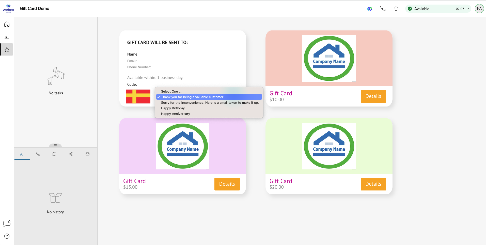

## Gift Card Widget Sample

In this tutorial we leverage our desktop API and Webex Connect through a widget to easily allow an agent to send out a gift card to a customer via SMS and Email.

## [Watch: Gift Card Sample Widget](https://app.vidcast.io/share/fbc138f2-34ff-4d2c-8351-f389d462f233)

This sample covers sending an outbound SMS and Email using an auto populated widget that populates information using CAD variables.

## Pre-requisites

For this to work effectively, please setup your inbound Voice Flow with 2 variables named Email and Name respectively.

A sample flow called `GiftCardVoiceFlow.json` is attached which hardcodes these values of` Name` to `Customer Name` and `Email` to `customer@email.com` respectively.
Please change these values as needed.

These are the variables that will autopopulate when a new call comes in.

**Example Variable 1: Email**

**Example Variable 2: Name**

> Usually, both these variables will be auto populated when a new call comes in by dipping into a CRM and setting these values inside the flow accordingly.

The Desktop Layout is attached as `SampleDesktopLayout.json`

## Developer Documentation

**https://developer.webex-cx.com/documentation/guides/desktop**

## Getting Started

The widget can be hosted locally and the demo covers how this is done by building and hosting the widget on localhost.

> To understand how to interact with our Desktop Layout, please watch the video and supplemental detailed documentation @ **[Desktop Layout - Administration Guide](https://www.cisco.com/c/en/us/td/docs/voice_ip_comm/cust_contact/contact_center/webexcc/SetupandAdministrationGuide_2/b_mp-release-2/b_cc-release-2_chapter_011.html#topic_8230815F4023699032326F948C3F1495)**
> To understand more about the Desktop STORE, please also look at the **useful links** below for additional references.

### Executing the sample

How to run the sample widget:

- **Step 1:**

_To use this widget sample on your localhost_

- Inside this project on your terminal type: `npm install`
- Then inside this project on your terminal type: `npm run dev`
- This should run the app on your localhost:3000

**Step 2:**

_To wire up the Widget to the Layout:_

- Upload the **_gift-card-widget-sample.json_** file onto your Administration Portal **[WebexCC Portal - US](https://portal.wxcc-us1.cisco.com/portal/home.html#)**
  - _link above is referencing the US portal link please change if you are in different geo (us1, eu1, eu2, anz1)_
  - Note that Layouts are configured per Agent Team.
- Log in to your agent and select the right Team to view the new layout.

**To wire up the Voice Contact Flow:**

- Download the attached `GiftCardVoiceFlow.json` and upload it as a Voice flow.
- It has a simple queue block but has the required CAD variables `Email` and `Name` hardcoded. Modify as needed.

**To wire up the WebexConnect Flows:**

- Upload the `WebexConnectEmail.workflow` and `WebexConnectSMS.workflow` into the Webex Connect Administration Portal.
- Change the Webhook URLs to correctly execute these flows.
- For more information on configuring the Webex Connect Webhooks to Flows, refer:

**Additional Improvements:**

- You can modify the widget as required by changing the images inline.
- To create a new compiled JS file, using `npm run build` which will create the new compiled JS under `build/bundle.js`.
- You may rename this file, host it on your server of choice, and use this as the widget `src` parameter in the layout.

## Useful Links

**[Desktop Layout](https://www.cisco.com/c/en/us/td/docs/voice_ip_comm/cust_contact/contact_center/webexcc/SetupandAdministrationGuide_2/b_mp-release-2/b_cc-release-2_chapter_011.html#topic_8230815F4023699032326F948C3F1495)**

## Disclaimer

> These samples are meant to be used, as "samples", for demos, and to understand how to interact w
> ith the WebexCC APIs.
> When building a production grade solution, please consider the overall architecture and design with a security first approach.
> Also, please consider how you would extend this app for multiple orgs, manage tokens for the orgs, etc.
> These samples are only meant to provide working, starter code and many layers have been simplified and abstracted away to focus on the Webex Contact Center use cases.

## Support

For dedicated Developer Support on the APIs - Please open a ticket with the team using this link: **[Webex Contact Center Developer Support](https://developer.webex-cx.com/support)**

For discussions on the samples, feel free to participate in our Developer Community:

**[Webex Contact Center APIs Developer Community](https://community.cisco.com/t5/contact-center/bd-p/j-disc-dev-contact-center)**

Refer: **[How to Ask a Question or Initiate a Discussion](https://community.cisco.com/t5/contact-center/webex-contact-center-apis-developer-community-and-support/m-p/4558270)**

## Version History

- 1.0.0
  - Initial sample widget
